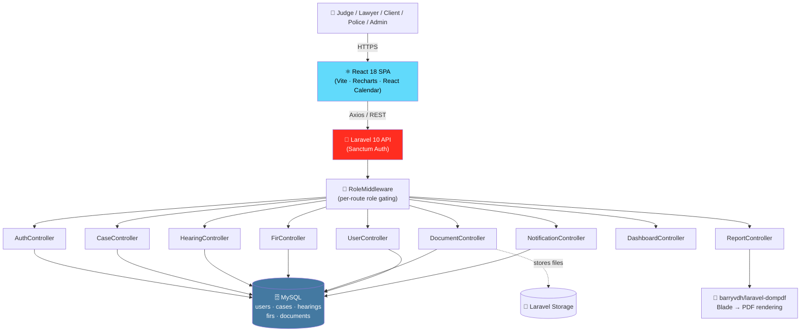
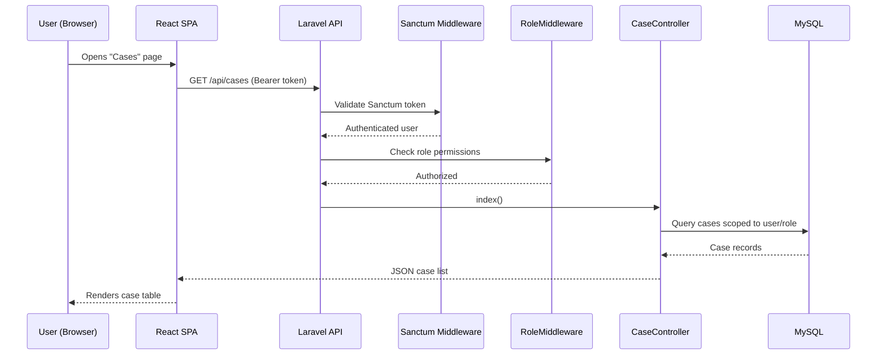
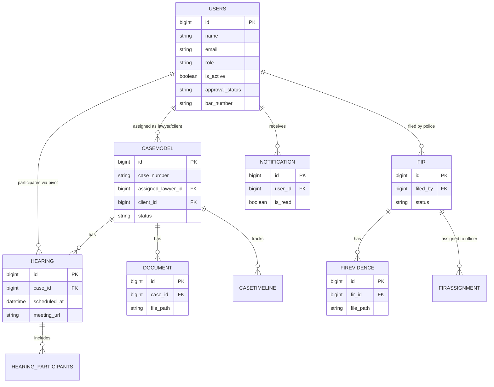

<div align="center">

# ⚖️ Judicial Portal — Court Case Management System

### A Role-Based, Multi-Stakeholder Digital Justice Platform

**One portal for Judges, Lawyers, Clients, Police, and Court Administrators to manage cases, hearings, FIRs, and documents end-to-end.**

[](https://www.php.net/)
[](https://laravel.com/)
[](https://react.dev/)
[](https://vitejs.dev/)
[](https://laravel.com/docs/sanctum)
[](https://www.docker.com/)
[](#-license)

[](https://github.com/GIRICHANDAN125/Judicial-Portal-Own)
[](https://github.com/GIRICHANDAN125/Judicial-Portal-Own/commits/main)
[](https://github.com/GIRICHANDAN125/Judicial-Portal-Own/issues)

[Report Bug](https://github.com/GIRICHANDAN125/Judicial-Portal-Own/issues) · [Request Feature](https://github.com/GIRICHANDAN125/Judicial-Portal-Own/issues)

</div>

---

## 📖 Overview

Court systems involve many stakeholders — judges, lawyers, clients, police, and clerks — each needing different visibility into the same case data, under strict access boundaries. Paper files and disconnected systems make tracking a case's status, hearing schedule, and evidentiary documents slow and error-prone.

### The Business Problem

- Case status, hearing dates, and documents are scattered across departments.
- Different stakeholders (police, lawyers, judges, clients) need different views of the *same* case with strict access control.
- FIR (First Information Report) data filed by police needs to flow into the judicial case pipeline securely.
- Manual report generation for case and hearing summaries is slow and inconsistent.

### The Technical Solution

Judicial Portal is a Laravel 10 (API) + React 18 (SPA) application with **seven distinct user roles** enforced via a custom `RoleMiddleware`, giving each stakeholder a scoped view of cases, hearings, FIRs, and documents — backed by Laravel Sanctum token authentication and PDF report generation via `barryvdh/laravel-dompdf`.

### Real-World Use Case

A police officer files an FIR through their dashboard. A court admin reviews and converts it into a formal case, assigning a judge and lawyer. The judge schedules hearings (including video hearings via a meeting URL field). The assigned lawyer and client can track hearing dates, upload supporting documents, and download official case/hearing/FIR reports as PDFs — all from role-appropriate dashboards.

### Scalability Considerations

- Stateless Sanctum token auth (no server-side session affinity required) — backend can scale horizontally behind a load balancer.
- Dockerized PHP-FPM + Nginx backend with a documented Railway/Render deployment path and managed MySQL.
- Role checks are enforced centrally via route-group middleware (`role:super_admin,court_admin,judge`), keeping authorization logic auditable in one place (`routes/api.php`) rather than scattered through controllers.
- Database migrations are incremental and versioned, allowing schema evolution (e.g. FIR tables, approval workflow) without destructive rewrites.

---

## ✨ Key Features

| Feature | Description |
|---|---|
| 🧑‍⚖️ **7-Role Access Control** | `super_admin`, `court_admin`, `judge`, `lawyer`, `clerk`, `client`, `police` — each with scoped permissions |
| 🔐 **Sanctum Token Authentication** | Stateless API token auth with `auth:sanctum` middleware on all protected routes |
| ✅ **User Approval Workflow** | New registrations require admin approval/rejection before activation |
| 📁 **Case Management** | Full CRUD for cases, restricted to Admin/Judge roles; public case lookup by case number |
| 📅 **Hearing Scheduling** | Hearing CRUD, calendar view, participant tracking, and video-hearing meeting URLs |
| 🚓 **FIR Management** | Police can file/manage FIRs; evidence upload; visibility extended to judges, lawyers, and clients on linked cases |
| 📄 **Document Management** | Upload, list, download, and delete case-related documents |
| 🔔 **Notifications** | Per-user notification feed with read/unread + mark-all-as-read |
| 📊 **Reports (PDF)** | Case, hearing, and FIR reports rendered server-side via Blade + DOMPDF |
| 📈 **Role-Aware Dashboard** | Aggregated stats scoped to what each role is permitted to see |
| 🌐 **Public Case Lookup** | Anonymous lookup of a case by case number without authentication |

---

## 🏗️ System Architecture



---

## 🔄 Application Flow

### User Journey (Police → Court → Judge)

```mermaid
flowchart LR
    A[Police Registers / Logs In] --> B[Files FIR + Evidence]
    B --> C[Court Admin Reviews FIR]
    C --> D[Case Created & Linked to FIR]
    D --> E[Lawyer & Client Assigned]
    E --> F[Judge Schedules Hearing]
    F --> G[Participants Notified]
    G --> H[Documents Uploaded by Stakeholders]
    H --> I[Reports Generated as PDF]
```



### Request Lifecycle (Authenticated Case Fetch)



---

## 📸 Screenshots

> Replace these placeholders with real screenshots from `/docs/screenshots/`.

| Login | Dashboard |
|---|---|
|  |  |

| Case Detail | Hearing Calendar |
|---|---|
|  |  |

| FIR Management | Admin Panel |
|---|---|
|  |  |

---

## 🛠️ Technology Stack

| Layer | Technologies |
|---|---|
| **Frontend** | React 18, Vite 5, React Router 6, Recharts, React Calendar, date-fns, Lucide Icons, Axios |
| **Backend** | PHP 8.1+, Laravel 10, Laravel Sanctum (API tokens) |
| **Database** | MySQL (relational, migration-driven schema) |
| **Authentication** | Laravel Sanctum token auth + custom `RoleMiddleware` for 7 roles |
| **Reporting** | `barryvdh/laravel-dompdf` (Blade templates → PDF) |
| **DevOps** | Docker (PHP-FPM + Nginx), `docker-entrypoint.sh` bootstrap script |
| **Cloud / Hosting** | Vercel (frontend), Railway / Render (backend), managed MySQL |
| **Tooling** | ESLint, Tailwind CSS, Composer, Laravel Pint, PHPUnit, Faker |

---

## 📂 Project Structure

```
Judicial-Portal-Own/
├── backend/                              # Laravel 10 API
│   ├── app/
│   │   ├── Http/
│   │   │   ├── Controllers/
│   │   │   │   ├── AuthController.php
│   │   │   │   ├── CaseController.php
│   │   │   │   ├── HearingController.php
│   │   │   │   ├── FirController.php
│   │   │   │   ├── DocumentController.php
│   │   │   │   ├── UserController.php
│   │   │   │   ├── ReportController.php
│   │   │   │   ├── DashboardController.php
│   │   │   │   └── NotificationController.php
│   │   │   └── Middleware/
│   │   │       ├── RoleMiddleware.php
│   │   │       ├── Cors.php
│   │   │       └── Authenticate.php
│   │   ├── Models/                       # User, CaseModel, Hearing, Fir, Document...
│   │   └── Providers/
│   ├── database/
│   │   ├── migrations/                   # 12 versioned migrations
│   │   └── seeders/                      # DatabaseSeeder, DemoDataSeeder
│   ├── resources/views/reports/          # case.blade.php, fir.blade.php (PDF templates)
│   ├── routes/api.php
│   ├── Dockerfile
│   ├── docker-entrypoint.sh
│   ├── nginx.conf
│   └── DEPLOYMENT.md
├── frontend/                              # React 18 + Vite SPA
│   ├── src/
│   │   ├── components/common/            # Header, Sidebar, Layout, ProtectedRoute
│   │   ├── contexts/AuthContext.jsx
│   │   ├── pages/                        # Dashboard, Cases, Hearings, Documents, Users...
│   │   ├── pages/police/                 # PoliceDashboard, FirList, FirForm, FirDetail
│   │   └── services/api.js
│   ├── vercel.json
│   └── vite.config.js
└── DEPLOYMENT.md
```

---

## 🌐 API Documentation

### Public Routes

| Method | Endpoint | Description |
|---|---|---|
| POST | `/api/register` | Register a new account (pending approval) |
| POST | `/api/login` | Authenticate, receive Sanctum token |
| POST | `/api/forgot-password` | Initiate password reset |
| GET | `/api/public/cases/{case_number}` | Public case lookup |

### Authenticated Routes (`auth:sanctum`)

| Method | Endpoint | Description | Role Restriction |
|---|---|---|---|
| GET | `/api/dashboard` | Role-scoped dashboard stats | Any authenticated user |
| GET | `/api/cases` | List cases | Any authenticated user |
| GET | `/api/cases/stats` | Case statistics | Any authenticated user |
| GET | `/api/cases/{id}` | Case detail | Any authenticated user |
| POST / PUT / DELETE | `/api/cases` | Create / update / delete case | `super_admin, court_admin, judge` |
| GET | `/api/hearings` | List hearings | Any authenticated user |
| GET | `/api/hearings/calendar` | Calendar view | Any authenticated user |
| POST / PUT / DELETE | `/api/hearings` | Manage hearings | `super_admin, court_admin, judge` |
| GET / POST | `/api/documents` | List / upload documents | Any authenticated user |
| GET | `/api/documents/{id}/download` | Download document | Any authenticated user |
| GET | `/api/firs` | List FIRs | `police, super_admin, judge, client, lawyer` |
| POST / PUT / DELETE | `/api/firs` | Manage FIRs | `police, super_admin` |
| POST | `/api/fir-evidences` | Upload FIR evidence | `police, super_admin` |
| GET / POST / PUT / DELETE | `/api/users` | User management | `super_admin, court_admin` |
| POST | `/api/users/{id}/approve` \| `/reject` | Approve/reject registration | `super_admin, court_admin` |
| GET | `/api/reports/case/{id}` | Case PDF report | Authenticated participant |
| GET | `/api/reports/hearing/{id}` | Hearing PDF report | Authenticated participant |
| GET | `/api/reports/fir/{id}` | FIR PDF report | Authenticated participant |
| GET | `/api/notifications` | List notifications | Any authenticated user |
| POST | `/api/notifications/{id}/read` | Mark as read | Any authenticated user |

---

## 🗄️ Database Design



---

## ⚙️ Installation Guide

### Prerequisites

- PHP ≥ 8.1, Composer
- Node.js ≥ 18
- MySQL ≥ 8.0

### 1. Clone the Repository

```bash
git clone https://github.com/GIRICHANDAN125/Judicial-Portal-Own.git
cd Judicial-Portal-Own
```

### 2. Backend Setup

```bash
cd backend
composer install
cp .env.example .env
php artisan key:generate
# Configure DB_* variables in .env
php artisan migrate --seed
php artisan storage:link
php artisan serve
```

### 3. Frontend Setup

```bash
cd frontend
npm install
# Set VITE_API_URL in a .env file, e.g. VITE_API_URL=http://localhost:8000/api
npm run dev
```

### 4. Demo Data

`database/seeders/DemoDataSeeder.php` ships with sample users across all seven roles, sample cases, hearings, and FIRs — run `php artisan db:seed --class=DemoDataSeeder` for a ready-to-explore environment.

---

## 🐳 Docker

```bash
cd backend
docker build -t judicial-portal-backend .
docker run -p 80:80 --env-file .env judicial-portal-backend
```

The `Dockerfile` provisions PHP-FPM with the MySQL, mbstring, GD, and bcmath extensions, installs Composer dependencies (`--no-dev --optimize-autoloader`), configures Nginx via `nginx.conf`, and bootstraps the container through `docker-entrypoint.sh` (running migrations/caching on startup).

---

## 🚀 Deployment

Documented in full in [`DEPLOYMENT.md`](./DEPLOYMENT.md). Summary:

| Component | Target | Notes |
|---|---|---|
| Frontend | **Vercel** | Root directory `frontend`, build `npm run build`, output `dist`, `VITE_API_URL` env var |
| Backend | **Railway** (or Render) | Build: `composer install --no-dev --optimize-autoloader && php artisan migrate --force && php artisan db:seed --force && php artisan storage:link`. Start: `php artisan serve --host=0.0.0.0 --port=$PORT` |
| Database | **Railway MySQL** add-on (or any managed MySQL) | Connection details injected as env vars |

---

## 🔒 Security Features

- **Laravel Sanctum** token-based authentication — no server-side session state required for the API.
- **Role-Based Access Control** — a dedicated `RoleMiddleware` gates every sensitive route group (`role:super_admin,court_admin,judge`, etc.), keeping authorization rules centralized and auditable.
- **Approval Workflow** — new accounts are inert until a `super_admin`/`court_admin` explicitly approves them, preventing unauthorized self-service access to sensitive case data.
- **CSRF & Cookie Encryption Middleware** — `VerifyCsrfToken`, `EncryptCookies` retained from Laravel's defaults for any cookie-based flows.
- **CORS Middleware** — custom `Cors.php` controls cross-origin access from the deployed frontend domain.
- **Input Trimming** — `TrimStrings` middleware sanitizes incoming request data.
- **Password Hashing** — Laravel's built-in `hashed` cast on the `User` model.

---

## ⚡ Performance Optimizations

- **Composer Production Build** — `composer install --no-dev --optimize-autoloader` minimizes class-loading overhead in production.
- **Database Indexing via Migrations** — foreign keys on `cases`, `hearings`, `firs`, and `documents` support efficient joins for role-scoped queries.
- **Lazy-Loaded React Routes** — page-level components are split per route, reducing initial bundle size.
- **Server-Rendered PDF Reports** — report generation happens server-side via Blade + DOMPDF rather than client-side, keeping the SPA bundle lean.
- **Public Case Lookup Caching Opportunity** — the anonymous `/public/cases/{case_number}` endpoint is a strong candidate for response caching given its public, read-only nature (see Future Enhancements).

---

## 🔮 Future Enhancements

1. Horizontal Pod Autoscaling / containerized Kubernetes deployment for the backend
2. WebSocket-based real-time notifications instead of polling
3. Full-text search across case documents
4. E-signature integration for court orders and judgments
5. Audit trail / activity log for every case mutation
6. Multi-language UI (regional language support for courts)
7. SMS notifications for hearing reminders
8. Integration with government ID verification APIs for client onboarding
9. Bulk case import/export (CSV/Excel)
10. Two-factor authentication for judge and admin roles
11. Document versioning with diff view
12. Calendar sync (Google Calendar / Outlook) for hearing schedules
13. Automated case status transitions based on hearing outcomes
14. Dedicated mobile app for police FIR filing in the field
15. GitHub Actions CI/CD pipeline with automated PHPUnit + frontend test runs

---

## 👨‍💻 Author

**Chandu Giri**
Full Stack Developer · B.Tech Computer Science & Engineering

[](https://www.linkedin.com/in/girichandan/)
[](mailto:girichandu29@gmail.com)
[](https://github.com/GIRICHANDAN125)

---

## 💬 Support

- Open an [issue](https://github.com/GIRICHANDAN125/Judicial-Portal-Own/issues) for bugs or feature requests
- Check [`DEPLOYMENT.md`](./DEPLOYMENT.md) for full hosting walkthroughs
- ⭐ Star the repo if this project was useful to you

---

## 📄 License

This project is licensed under the **MIT License**. See [LICENSE](./LICENSE) for details.

<div align="center">

Built to make justice a little more accessible, one role-aware dashboard at a time — by **Chandu Giri**

</div>
